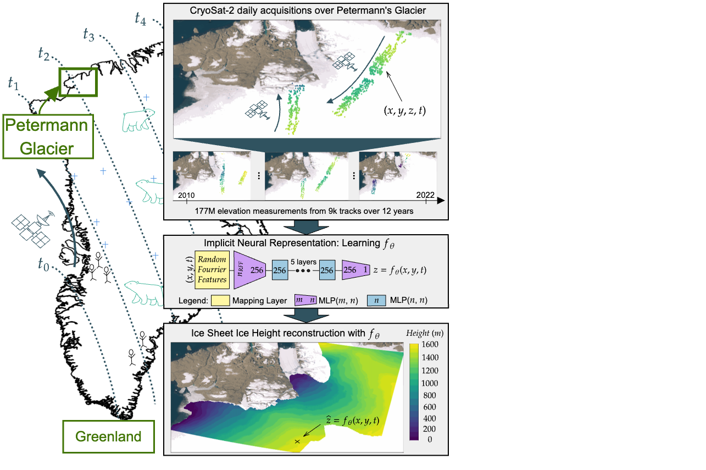

# IceSheetReconstruction code, part of the ISRIN code

[](https://doi.org/{{your-doi-here}})
[](https://arxiv.org/abs/{{arXivpaperID}})
[]({{Official_Journal_Article_URL}})

<figure>
    
    <figcaption>Workflow overview. Under, we can see a Map of Greenland with a green bounding box over the area of Petermann Glacier. In the top right, examples of daily ground acquisitions over the glacier, where one sample from the 12.5 year time series is enlarged. In the middle frame, Ice Sheet surface elevation reconstruction Model: Implicit Neural Representation. In the bottom right frame, Ice Sheet surface elevation reconstruction for a given time t.</figcaption>
</figure>

Code to train an Implicit Neural Representation on altimeter data of Petermann glacier in order to reconstruct the ice sheet elevation at any given time or location.

## 📖 Overview

This repository contains the code and configuration for reproducing the experiments and results from the paper:
**"Implicit Neural Representation for Ice Sheet Surface Elevation Reconstruction"** by Peter Naylor, Andreas Stokholm, Natalia Havelund Andersen, Nikolaos Dionelis, Quentin Paletta, Sebastian Bjerregaard Simonsen.

It is built using a combination of Python for data processing/modeling and Nextflow to orchestrate the computational workflow, ensuring reproducibility and scalability.

## 📦 Installation & Setup

### 1. Prerequisites

*   **Python 3.8:** The code is tested with Python 3.8. We recommend using conda.
*   **Nextflow:** Requires a Java JRE (version 8 or later) and Nextflow itself.
*   **(Optional) Conda/Mamba:** Used by Nextflow to manage environments for each process (highly recommended).

### 2. Install Python Dependencies

1.  Clone this repository:
    ```bash
    git clone https://github.com/PeterJackNaylor/IceSheetReconstruction.git
    cd IceSheetReconstruction
    ```

2.  Create and activate a virtual environment (optional):
    ```bash
    python3.8 -m venv venv
    source venv/bin/activate  # On Windows: .\venv\Scripts\activate
    ```

3.  Install the required Python packages:
    ```bash
    pip install -r requirements.txt
    ```
4. The code is based on third-party package `INR4Torch` (https://github.com/PeterJackNaylor/INR4torch/tree/master) that can be found here: . It is implemented via `git submodules` and should work out of the box.
### 3. Install & Configure Nextflow

1.  Install Nextflow (if not already installed):
    ```bash
    curl -s https://get.nextflow.io | bash
    ```

2.  **Configure Nextflow for your hardware:**
    This is a crucial step. Nextflow's power comes from its ability to run on various executors (local, SLURM, AWS Batch, etc.). You must create or modify a `nextflow.config` file in the project's root directory to match your setup.

    *   **For a local machine:** The default config might be sufficient for small runs. For larger runs, you will need to adjust the `cpus` and `memory` directives for processes in your `main.nf` pipeline script or in a `base.config` file included by `nextflow.config`.
    *   **For a cluster (HPC/SLURM):** You will need a config profile. An example `nextflow.config` might look like this:
    ```groovy
    // nextflow.config
    process {
      executor = 'slurm'
      queue = 'your_queue_name'
      // Generic resource labels for your cluster
      cpus = { 4 }
      memory = { 8.GB }
      time = { 2.h }
    }

    env {
        // your ENV parameters here
        PYTHONPATH="$PWD:$PWD/INR4torch"
    }
    ```
    *   **For Cloud providers:** You will need to use specific config profiles provided by Nextflow (e.g., for AWS Batch or Google Life Sciences). Please refer to the [Nextflow Documentation](https://www.nextflow.io/docs/latest/config.html) for detailed instructions.

## 🗄️ Data

The data required to run the experiments is available at:
**{{ Link to data repository (e.g., Zenodo, Figshare, etc.) }}**

| File/Folder       | Description                                                                 |
| ----------------- | --------------------------------------------------------------------------- |
| `raw_data.npy`       | Contains the raw input data.    |
| `test_index_for_train` | Folder containing the indices corresponding to the different train/test splits to easily divide the CroySat-2 data for training and testing.   |
| `preprocessed_data.npy` | Contains the processed/intermediate data (created by the pipeline for the large temporal range).         |
| `polygons` | Folder containing the geojson that allow to define zone: training, validation and to divide Petermann glacier into outlet, center, etc...         |
| `test` | Folder containing the different test sets Contains the processed/intermediate data (created by the pipeline for the large temporal range).         |

1.  Download the data from the source above.
2.  Extract it and modify the configuration yaml file below to match the correct path.

*Note: The original raw data is provided for reproducibility. The pipeline scripts will generate all processed data and results from it.*

## 🚀 Reproducing the Experiments

Once the environment is set up and the data is in place, you can run the entire pipeline using Nextflow.

The main command is:
```bash
nextflow run main.nf -profile {{your_profile}} -params-file {{your_nextflow_params_file}}

-profile: This flag specifies the personal computational configuration profile. Define these profiles in your nextflow.config. Use -profile standard or omit the flag if using the default local executor with manual environment setup.

--params-file: Specifies the yaml file with the nextflow and higher-level configurations.

-resume: flag to use if you wish to resume from cached data.
```

## Pipeline Steps
The `main.nf` pipeline executes the following steps:

1. Data Preprocessing (`pre-processing/preprocess.py`): Cleans and prepares the raw data.
2. Dem preprocessing (`dem_contours.py`): Cleans and prepares the ArticDEM to be used as a boundary loss term.
3. Model Training (`optuna_runs.py`): Trains the machine learning model with `optuna` to choose the best hyperparameters
4. Evaluation & Plotting (`evaluation/`): Contains python files that allow to evaluate and plot the different metrics and figures.

Final results, including trained models, prediction outputs, and figures, will be placed in the `outputs/` directory with the name specified in the `nextflow-config.yaml` configuration yaml.

## ⚙️ Configuration Files
The behavior of the pipeline is controlled by several YAML configuration files in the conf/ directory. This allows you to change parameters without modifying the code.

| File     | Description                                                                 |
| ----------------- | --------------------------------------------------------------------------- |
| `yaml_config/{{study_name}}/nextflow-config.yaml`       | Defines paths to input data files and parameters for data preprocessing (e.g., train/test split). |
| `yaml_config/{{study_name}}/inr-config.yaml` | Specifies hyperparameters for the model (e.g., learning rate, number of layers, regularization).|
| `yaml_config/dem-contours-config.yaml` | Sets parameters for the training process (e.g., number of epochs, batch size, random seed). |
| `yaml_config/pre_processing-config.yaml` | Sets parameters for the training process (e.g., number of epochs, batch size, random seed). |

To run the pipeline with a custom configuration, you can create a new YAML file and pass it to the respective script within the Nextflow process.

## 📂 Project Structure
```bash
IceSheetReconstruction
├── data/                     # Data directory (not version-controlled, must be created by user)
│   ├── raw_data.npy          # Raw input data
│   ├── test_index_for_train/ # Test data
│   ├── test/                 # Test data
│   └── polygons/             # Polygons
├── yaml_configs/                          # Configuration folder for files in YAML format
│   ├── {{project_name}}/                  # Project name
│              ├── nextflow-config.yaml    # Main config files which controls the nextflow
│              └── inr-config.yaml         # Main INR config files which controls the training
│   ├── dem-contours-config.yaml           # Parameters for how the ArticDEM data will be used as boundary information
│   └── pre-processing-config.yaml         # Parameters for the preprocessing
├── INR4Torch/              # Base code for the INR
├── IceSheetPINNs/          # Source code (Python scripts)
│   ├── dataloader.py       # data loader in the INR4torch format
│   ├── model_pde.py        # density estimator in the INR4torch format
│   ├── optuna_runs.py      # training performed with hyperparameter tunning
│   ├── single_run.py       # single training performed
│   ├── ...
│   └── ...
├── evaluation/             # Contains code for evaluating the model
├── postprocessing/         # Contains code for postprocessing
├── pre-processing/         # Contains code for preprocesing
├── workflows/         # Nextflow pipeline definition
│   └── main.nf
├── outputs/                  # Final results (created by pipeline, add to .gitignore)
│      ├── {{project_name}}/  # Specific project results
│      └── ...
├── main.nf            # Nextflow pipeline file
├── requirements.txt   # Python dependencies
├── nextflow.config    # Nextflow configuration (for your executor/hardware)
└── README.md          # This file
```

## 📜 License

This project is licensed under the MIT License - see the LICENSE file for details.

## 🙏 Citation
If you use this code or data in your research, please cite our paper:

```bash
@article{{yourCitationKey,
    author = { {Author List} },
    title = { {Paper Title} },
    journal = { {Journal Name} },
    year = { {Year} },
    doi = { {your-doi-here} }
}
```
